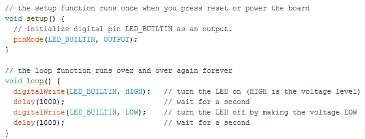
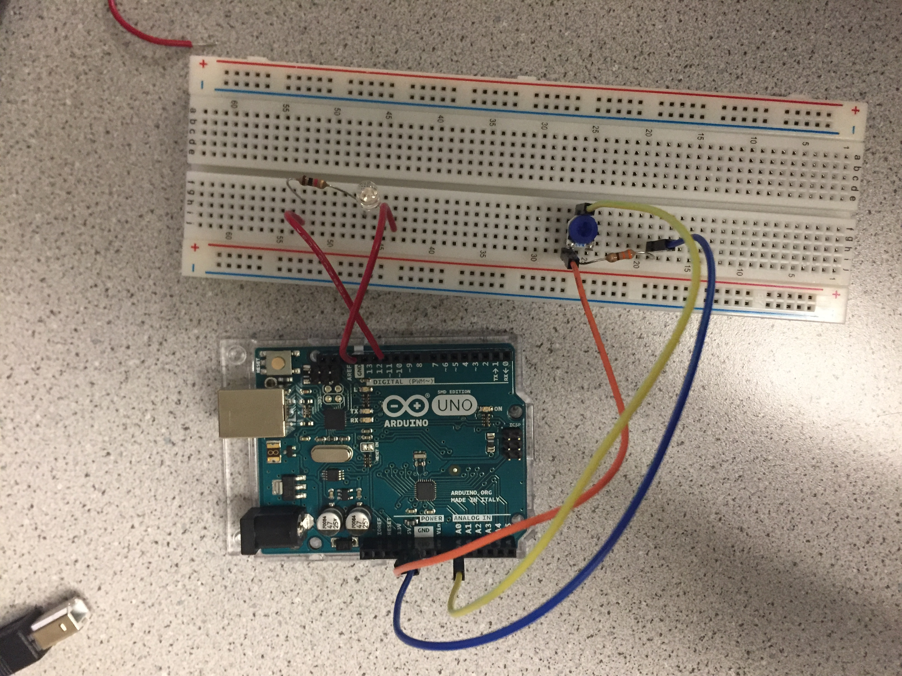
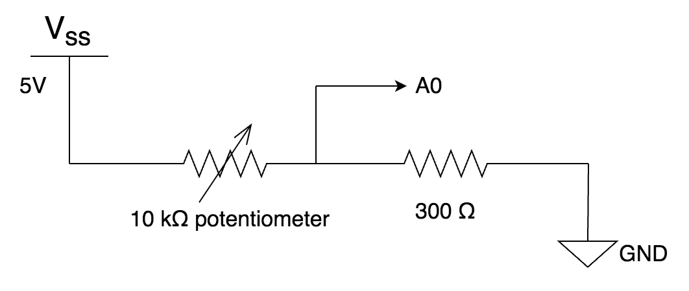
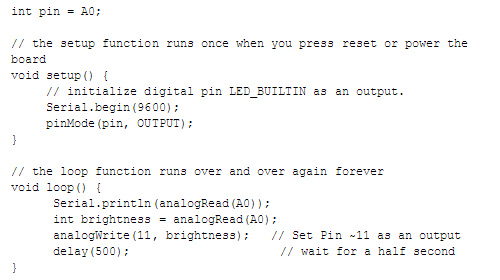
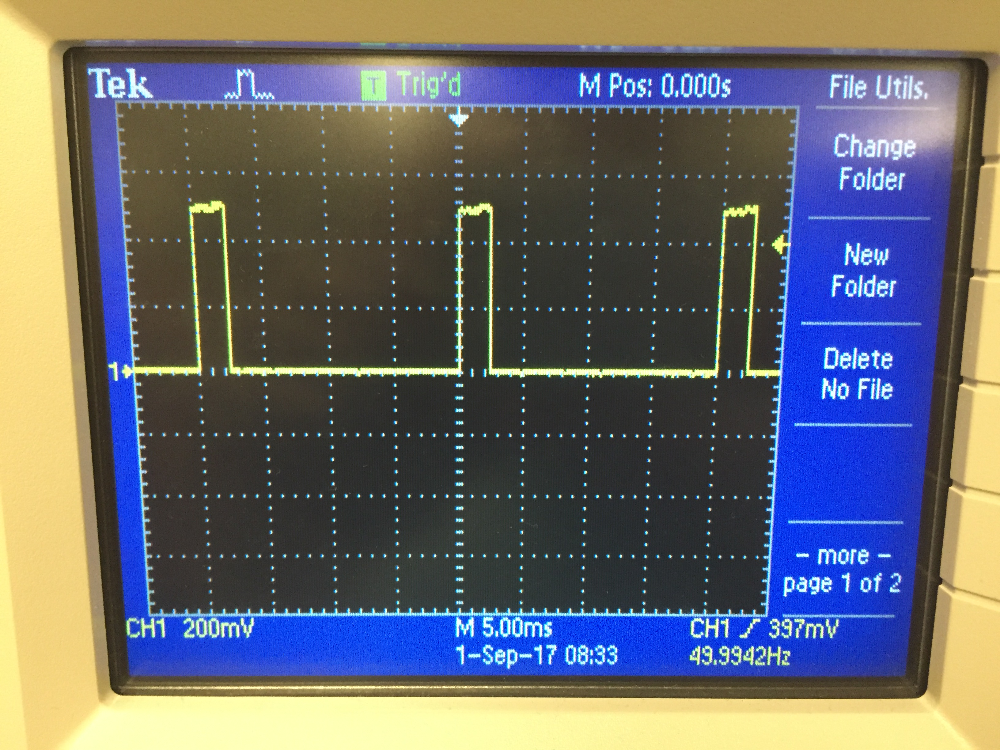
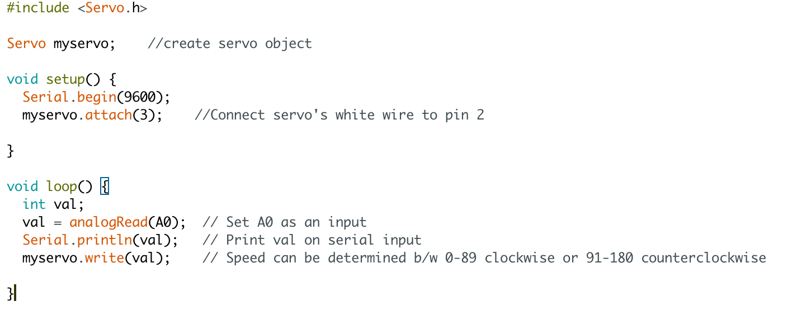
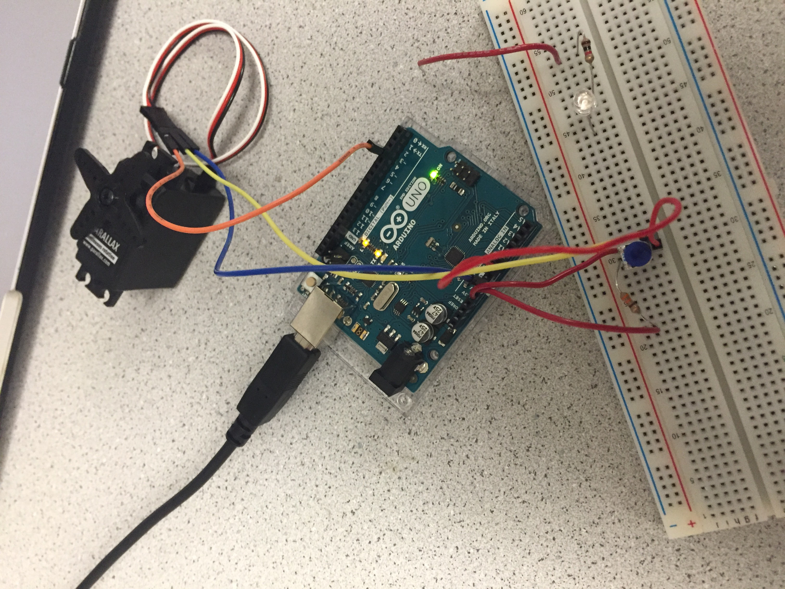
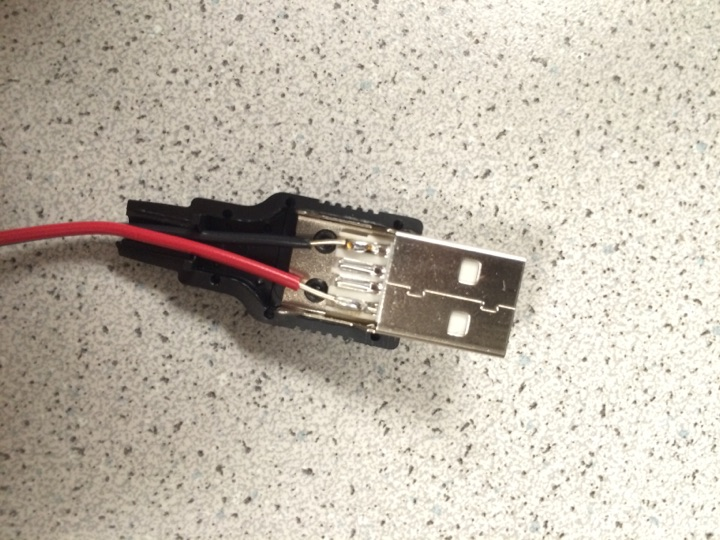
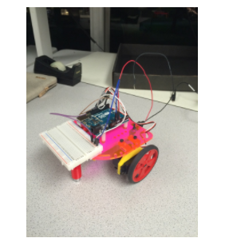

# ECE3400 Fall 2017
## Lab 1: Microcontroller

### Materials
* Arduino Uno
* Parallax Servos
* 1k ohm resistors
* Potentiometer

### I: Introduction to [Arduino](https://www.arduino.cc/en/Main/arduinoBoardUno/) 

Testing example code: 
This code is copied directly from File >> Examples >> 1.Basics  >> Blink. The Arduino board includes a built-in LED light that is wired to pin 13. In the code, setup() initializes pin 13 as an output, and in loop(), the pin is repeatedly turned on (HIGH) for a second and off (LOW) for a second, thereby creating the blink effect.

We were instructed to modify “Blink” code to work on an external LED light. We connected the LED to pin 11 and added a 300 ohm resistor in to prevent burning out the LED, and modified the code accordingly.

### II: The Serial Monitor and the Analog Pins

This section provides an introduction to the six available analog pins on the Arduino Uno. First, the variable resistance of a potentiometer had to be digitally outputted on the serial monitor provided by the Arduino IDE. Second, the integer resistance values from the potentiometer had to be mapped to the LED utilizing the analogwrite() function. Third, the oscilloscope was used to analyze the PWM signal given off from the Arduino. Figure (2) shows how the potentiometer was powered as well as where a pull down resistor was placed in relevance to the rest of the circuitry. Figure (3) displays how the pull down resistor was used in reference to the LED, and the connection through digital pin 11. This connection was used as a data output from the Arduino Uno to the LED.

 
Figure (1): This picture displays the overall connection interface for this section of the lab. This includes the potentiometer, Arduino Uno, pull down resistors, and wires.

Figure (2): Here is a schematic diagram for the serial monitor hookup.

Figure (3): This diagram goes with the code in a) of this section.

#### Analog Output

a) The following code was used to map the potentiometer resistance values onto the LED for variable brightness settings. This code was adopted from the previous task of displaying the potentiometer’s resistance values on the Serial Monitor. The analogRead function inputted data from the A0 pin on the potentiometer, and stored the data as integer values into the variable brightness. The information stored in the variable brightness was outputted to the LED through pin 11 (see Figure 2) utilizing the analogWrite function.

In addition, the integer resistance values were outputted onto the serial monitor using the Serial.println function. Another part of the code to note was that the Serial monitor was initialized by “Serial.begin(9600).” 

b) We analyzed the PWM signal outputted by the Arduino on an oscilloscope. By utilizing the oscilloscope’s functionality such as the trig level and scope, the frequency of the signal was found to be 50 Hz.  Video of the PWM signal width (determined by on-off times) changing when turning the knob on the potentiometer: 

[Video of pwm signal](https://www.youtube.com/watch?v=k9b29WAHjoY)

### III. Parallax Servos

Another aspect of this lab was to connect and control parallax servos using the arduinos. There was two stages to this process: an initial step of controlling the servo by writing specific values to it, and a second stage of modifying the servo based on the potentiometer.

a) The circuitry setup between the arduino and the parallax servo. The servo is receiving power from the arduino  because in this case the noise would not be significant enough to affect the servo. The servo is connected directly to the arduino with the black wire connecting to GND, the red wire connecting to 5V, and the white wire connecting to A3. The pin A3 is selected due to its PWM capability, which is used to control the servo. You can view the video [here](https://www.youtube.com/watch?v=Pr55TmeegbQ).

Additional tests run on the servo were running it at 90 and a large set of values between 0 and 180. The signal of A3 was measured with the oscilloscope and the result is depicted in Figure 4. To create this capability, we used the #servo library and the code titled pwm_servo.ino. The frequency of this was 50 Hz, with the minimum duty cycle of 7.5 and a maximum duty cycle of 12. The following code was used to run the test.

 
Figure (5): PWM measured by oscilloscope when parallax is PWM controlled by hard coded values.

b) The second setup of the servo mimicked the first setup, however the PWM control was receiving data from the potentiometer rather than written values within the code. The setup was modified so that the potentiometer would output its values to A0, which would be written to ~3. Pin ~3 would be controlling the servo speed using PWM. The wiring follows figure 4. The code that controls this is pwm_servo.ino. The end result of the varying speeds dependent on the potentiometer is depicted in the following video.

[Running Servo from Potentiometer](https://youtu.be/Uc2sd-4aWMA)

 

Figure (6): Connection between the arduino and the servo

&nbsp;

Figure (7): Image of wiring shown in figure 4.

### IV. Robot Autonomy

In order to have the arduino powered without a long USB connected to it, we soldered two wires to a USB. We can use this to power the arduino with a power bank held at the bottom of the chassis. See figure (8) below:

Figure (8): Shows the soldered wires for the USB port

Below is an image of our robot after lab 1 with chassis, servos, arduino mounted and power bank on the bottom of the chassis

It is also important to note that the servos will have to be put in two separate directions (0 and 180) in order to go in the same direction due to their orientation, seen here:

And finally: a running robot (that goes in a straight line)! Huzzah!

